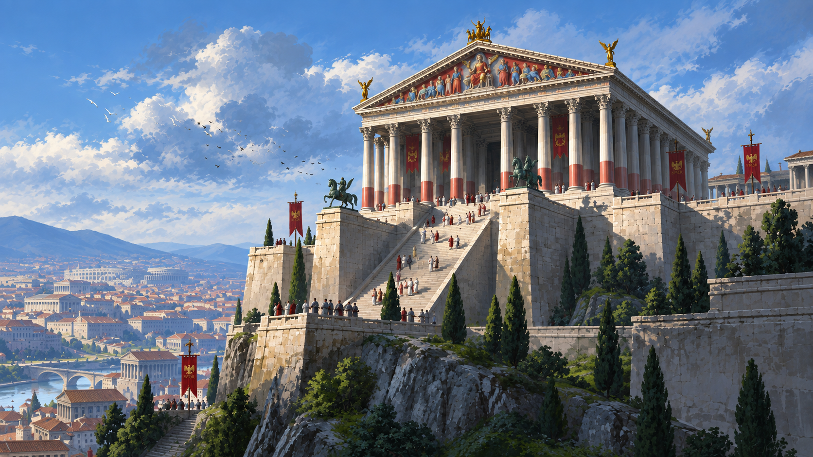

<p align="center">
  
</p>

# Omarchy Roman Republic Theme

An Omarchy light theme. Tent canvas is the ground. Ink is the letter. Tyrian purple, sagum red, and gold mark the rest.

## Install

```sh
omarchy-theme-install https://github.com/csfh/omarchy-roman-republic-theme
```

You can also install it from the Omarchy menu with `Super + Alt + Space`, then `Install > Style > Theme`, using this repository URL:

```text
https://github.com/csfh/omarchy-roman-republic-theme
```

## Palette

| Role | Hex |
| --- | --- |
| Background | `#f0e4c8` |
| Foreground | `#2a2218` |
| Accent | `#6b2c58` |
| Red | `#a83228` |
| Green | `#5a6434` |
| Yellow | `#9a6b14` |
| Magenta | `#7a2e5a` |
| Cyan | `#3d6b62` |

## Included

Desktop, terminal, editor, launcher, notification, bar, lock screen, browser, Discord, and TUI theme files for Omarchy:

`alacritty`, `btop`, `chromium`, `foot`, `ghostty`, `gtk`, `hyprland`, `hyprlock`, `kitty`, `mako`, `neovim`, `swayosd`, `vencord`, `vscode`, `walker`, `warp`, `waybar`, `wofi`, and `zellij`.

## Backgrounds

The wallpapers are original illustrations:

- [`campus-martius`](backgrounds/campus-martius.png) — troops on the field at sunrise
- [`comitia`](backgrounds/comitia.png) — the assembly and the SPQR stone
- [`capitol`](backgrounds/capitol.png) — the temple on the rock
- [`triumph`](backgrounds/triumph.png) — the procession up to Jupiter
- [`tiber`](backgrounds/tiber.png) — the river, the bridge, and the hill

## License

MIT. See [LICENSE](LICENSE). Copyright (c) 2026 Christoffer Hallas.

If you send a pull request or other contribution, you agree to the [CLA](CLA.md).
